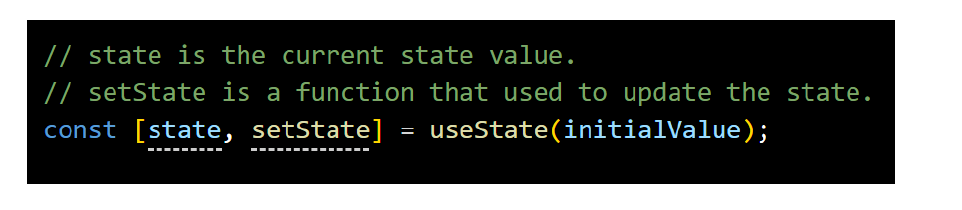
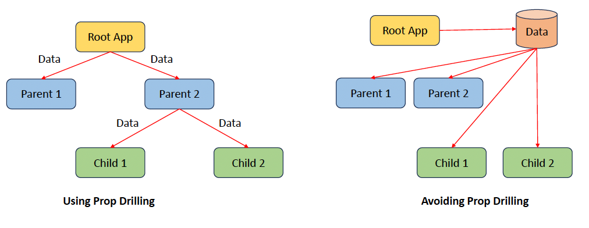
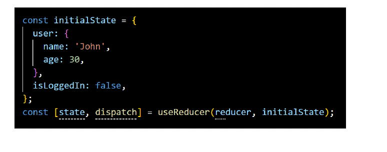
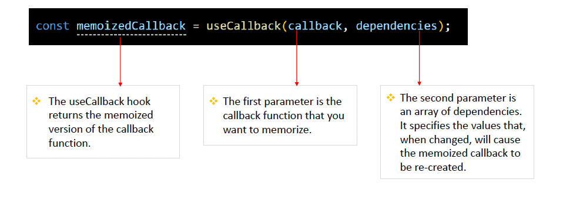
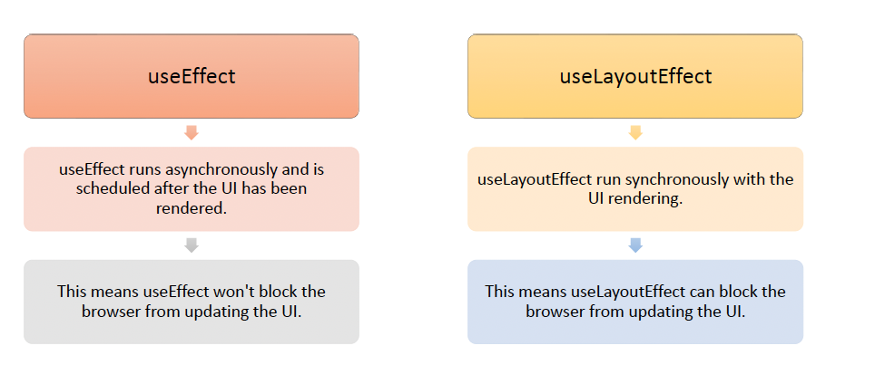
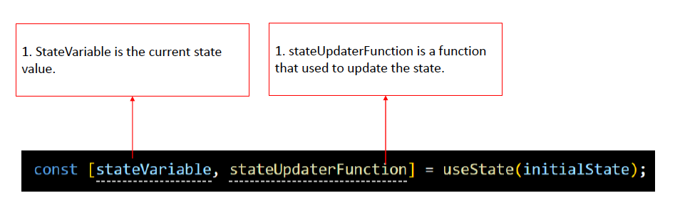
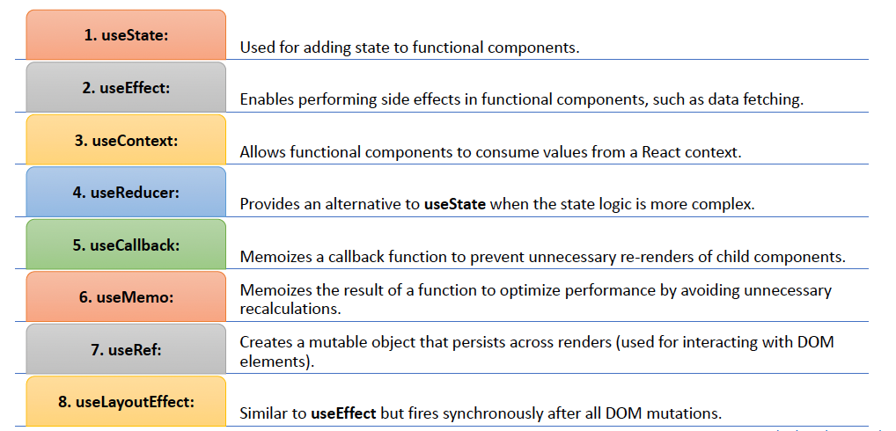

# Hooks

## useState/useEffect

Q1.What are React Hooks ?

**Answer**:React Hooks are inbuilt functions provided by React that *allow functional components to use state and lifecycle methods* 

Q2:In one Word explain the following React Hooks : useState,useEffect,useContext,useReducer,useCallback,useMemo,useRef,useLayoutEffect ? 

**Answer**:

| Hook            | One Word Definition      |
| --------------- | ------------------------ |
| useState        | State                    |
| useEffect       | side effects             |
| useContext      | Context                  |
| useReducer      | Complex state            |
| useCallback     | Memoization              |
| useMemo         | Performance              |
| useRef          | Refs                     |
| useLayoutEffect | Synchronous Side Effects |

Q3:What is State , stateful or State Management ? 

**Answer**:

State => current data of the component

Stateful/State Management => *When a user performs some actions on the UI , then the React application should be able to update and re-render that data or state on the UI* 

Q4:What is the syntax  of useState() Hook  ? 

**Answer**: 

 usestate() function accept the initial state value as the parameter and returns an array with two elements:

1.The first element is the current state value (count in this code).

2.Second element is the function that is used to update the state (setCount in this code).

Q5:What is the role of useEffect ? 

**Answer**: 

The useEffect Hook in React is used to perform *side effects in functional components*. 

For example, data fetching from APIthat needs to be performed after the component has been rendered.

Q5:useEffect() is called after the component renders  ? True/False 

**Answer**:True , useEffect() is called after the component renders 

Q6:Syntax of useEffect ? 

**Answer**: useEffect() function will accept two parameter (Effect function, dependency array(optional))

Q7:What is dependency Array in useEffect() Hook  ? 

**Answer**:

Dependencies arrays(optional) act as triggers for useEffect to rerun; meaning if any of dependencies values change, the code inside useEffect() will be executed again.

Q8:What is the meaning of the empty array[] in useEffect ? 

**Answer**: An empty array [] indicates that the effect function should only **run once** 

## Hooks -useContext/useReducer 

Q1:What is the role of useContext() Hook ? 

**Answer**:

Prop Drilling is the process of passing down props through multiple layers of components

useContext provides a way to pass data from parent to child component without using props

Q2:What us createContext() method ? 

**Answer**:

createContext() function returns an object with Provider and Consumer properties.

The Provider property is responsible for providing the context value to all its child components.

 Consumer property can be used to consume the context value in child components.

Q3:When to use useContext() hook instead of props in real applications ? 

**Answer**:Use useContext instead of props when we want to avoid prop drilling and access context values directly within deeply nested components 

Q4:What are the similiarities betweeb useState() and useReducer() Hook ? 
**Answer**:

Both hooks provide a way to **update state** and trigger a re-render of the component. 

Both useState and useReducer **return an array with two elements**: 

​	a.First element is current state

​	b.Second element is a function that can be 	used to update the state.

Q5:What is useReducer() Hook ? 

**Answer**: 

useReducer() is an alternative to the useState() hook when dealing with **complex state** in your components. 

Q6:What are the differences between useState() and useReducer() Hook ?

**Answer**:

| Differentiating Factor | useState                                                     | useReducer                                                   |
| ---------------------- | ------------------------------------------------------------ | ------------------------------------------------------------ |
| Suitability            | Suitable for managing a single piece of state                | Suitable for managing multiple pieces of state that needs to be updated together |
| Syntax                 | The useStatehook takes an initial state as an argument and returns an array with two elements: the current state and a function to update the state. | The useReducerhook takes a reducer function and an initial state as arguments and returns the current state and a dispatch function. |

Q7:What are dispatch and reducer function in useReducer Hook ? 

**Answer**:

- dispatch actions(type) to reducer function that triggers state updates
- Responsible for updating the state based on the action received from dispatch function

Q8:What is the purpose of passing initial state as an object in UseReducer ? 

**Answer**:

By setting initial state as an object , we can manage complex states with useReducer functions 

## useCallback/useMemo/useRef/useLayoutEffect 

Q1:What is the role of useCallback() hook in React ? 

**Answer**:

The useCallback hook is used to *memoize functions* in functional components.

When passing function as a prop from parent component to child component, then passing memoized function avoid unnecessary re-creation of the function on each render.

Q2:What parameter does the useCallback hook accept and what does it return ? 

**Answer**:

Q3:What is the role of useMemo() Hook ?

**Answer**:

Performance optimization function that memoizes the result of a computation

It prevents unnecessary recalculations and rendering 

Q4:Syntax of useMemo() Hook ?

**Answer**:

useMemo accept two parameters:The first argument of useMemo() is a function that performs some expensive computation and return some result(processData).

The second argument([data]) is an array of dependencies ([data]). The memorized value will only be recalculated if this dependency will change.

useMemo returns a memoized version of the calculated value.

Q5:What is the role of useRef() Hook ? 

**Answer**:

The useRef hook is primarily used for accessing and **interacting with the DOM elements**.

The advantage is, the useRef hook **persists across renders** and does not trigger re-renders when it changes. 

Q6:Compare useLayoutEffect() Hook with useEffect() Hook ? 

**Answer**:

Q7:When to use useLayoutEffect() Hook ? 

**Answer**:

The useLayoutEffect hook in React should be used when you need to perform actions that involve manipulating the layout of the DOM based on side effects, such as data fetching.

We want the layout changes to be reflected before the browser paints the updated UI.

## Hooks-Best Practises

Q1:Rules for hooks implentation 

**Answer**:

1. Hooks can only be called at the top level of a component
2. Hooks can only be called directly inside React components
3. Keep Hooks order consistent

Q2:What are Custom Hooks ? 

**Answer**:

Custom Hooks in React are Javascript functions developed by developers to encapsulate reusable logic 

Q3:What useState() hook return in React ? 

Q4:Tell 4 scenarios in which we can use useEffect() hook  ? 

**Answer**:

- Fetching data from external API
- For managing subscriptions or event listeners
- manual DOM manipulations
- setting up timers or intervals

Q5:How can we conditionally run effects with useEffect ? 

**Answer**:

In React, you can conditionally run effects with the useEffect hook by **placing the if-else condition inside** the hook itself. 

Q6:What problem do React Hooks solve ? 

**Answer**:

React Hooks solve problems related to managing state, lifecycle and side effects in functional components

Q6:What is the advantage of React Hooks over Lifecycle methods ? 

**Answer**:

Hooks eliminate the need for class components, making the code more readable and reducing boilerplate. 

Q7:What are the uses of all the Hooks in React  ? 

**Answer**:

